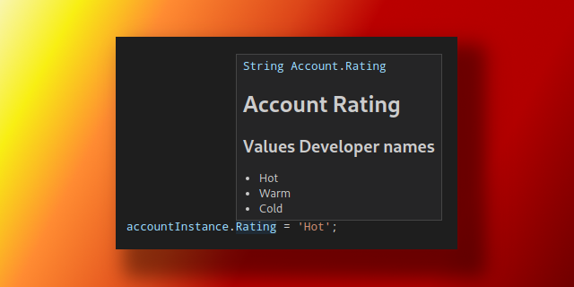
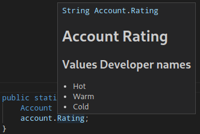
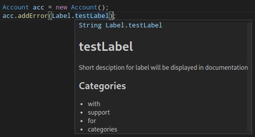

# Rich apex typings generator



Unofficial rich apex typings generator.
Based on my other [project](https://github.com/Ziemniakoss/apex-sobjects-typings-generator) that won't be maintained due to complications with the worst OS ever, windows.

## Why and What it does?

### What it does?

This plugin overrides (or creates) files used by official apex language server stored in .sfdx folder of project.
Currently, folders used for completions by this server are stored in:

-   .sfdx/tools/sobjects/standardObjects
-   .sfdx/tools/sobjects/customObjects

and for soql completions:

-   .sfdx/tools/soqlMetadata/stadardObjects
-   .sfdx/tools/soqlMetadata/customObjects



This plugin is also capable of generating labels typings.



### Why?

Unfortunately, only supported editor for automatically generating sObjects typings (containing only helpText) is VS Code, which is:

-   bloated,
-   constantly tires to become even more bloated by asking to install tons of useless plugins all the time and
-   lacks good vim emulation.

Without this tool, apex completions in other editors with language server support, like nevim, have to be created manually.

## How to install

```
sfdx plugins:install sfdx-apex-typings-generator
```

## How to use

To create SObjects typings, use

```cmd
sfdx apex-typings:sobject -s Account,Contact,Address,Ship__c
```

To remove existing typings for all typings, add -r flag

If you want to create custom labels typings, you can do so using

```cmd
sfdx apex-typings:labels -o path/to/file/in/which/albels/should/be/stored
```

Remember to:

-   add cls extension
-   place file in one of directories specified in sfdx-project.json file

because otherwise apex language server won't detect it
